# Architecture — Talent Chat (Janus Soft recruiting assistant)

Companion to [SPEC.md](SPEC.md) (revision 2026-09-27) and [PROMPT.md](PROMPT.md). `SPEC.md` is the source of truth. This file shows how the pieces fit end to end, phase by phase, and records the review decisions that were folded into `SPEC.md`.

Diagrams are PNG images, so they display in any Markdown viewer (Cursor preview, GitHub, a browser) without a Mermaid extension. Their sources are in [`docs/diagrams/`](docs/diagrams/) as `.mmd` files. After editing a source, run `scripts/render-diagrams.sh` on the DGX Spark to regenerate the PNGs.

---

## 1. System context (all phases)

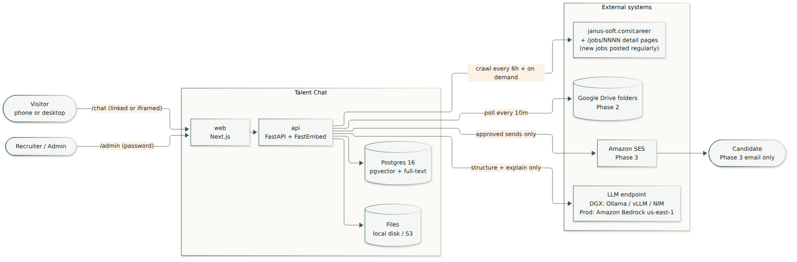

The model does two jobs only: it turns a résumé or job description into a JSON profile once per save, and it writes a short explanation of results that SQL already retrieved. Search, filters, scores, and clearance rules are plain code, so search keeps working when the model is down.

---

## 2. Phase roadmap

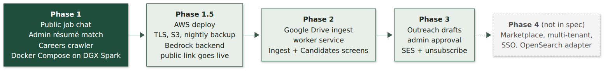

| Phase | Adds | Compose services | Runs where |
| --- | --- | --- | --- |
| **1** | Careers crawler (listing + detail pages), admin description override, public `/chat`, admin login, résumé upload + review, ranker | `web`, `api`, `postgres` | DGX Spark |
| 1.5 | Bedrock backend, S3 file adapter, TLS (Caddy or Cloudflare), nightly `pg_dump` to S3 | same + TLS | one `t4g.medium`, us-east-1 |
| 2 | Google Drive poller and backfill, Ingest and Candidates screens | + `worker` | same |
| 3 | Outreach scheduler, draft queue, admin approval, SES, unsubscribe | same | same |
| 4 | Marketplace, multi-tenant, SSO, OpenSearch adapter | not specified | — |

---

## 3. Phase 1 — containers and the public/admin boundary

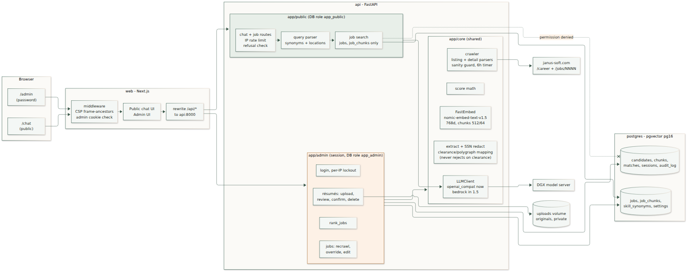

The public side cannot reach candidate data. Code layout and database permissions enforce that; the prompt does not.

- **Two Postgres roles.** Public routes connect as `app_public`, which can `SELECT` only `jobs`, `job_chunks`, `skill_synonyms`, and public settings. Querying `candidates` gets “permission denied.” Admin routes use `app_admin`.
- **Import boundary.** Nothing under `app/public/` may import `app/admin/` or the candidate repository. A test fails the build if it does.
- **Two public tools only**, `search_jobs` and `get_job`. The public LLM prompt contains retrieved job fields and nothing else.
- **Same-origin API.** The browser only talks to `web`; Next.js rewrites `/api/*` to `api`. The admin cookie stays first-party, and production doesn't expose the API port.

---

## 4. Phase 1 — key flows

### 4.1 Careers crawl (listing + detail pages)

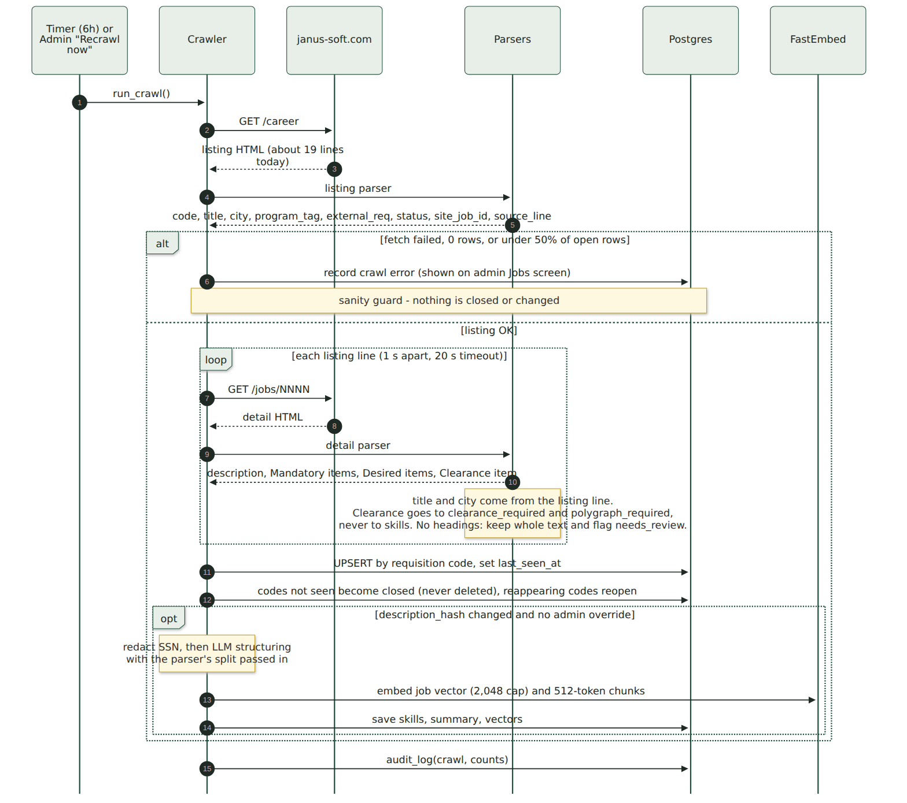

What the live site looks like on 2026-09-27: [`/career`](https://www.janus-soft.com/career) lists 19 open positions, each linking to a `/jobs/NNNN` detail page with the published description. Of the 19 detail pages, 15 use the headings Job Description / Mandatory Skills / Desired Skills, 3 lack the Job Description heading, and `/jobs/2008` has none at all. The clearance is a `Clearance:` item under Mandatory Skills, usually “Active TS/SCI with Full Scope Polygraph.” Snapshots of all 20 pages are in `tests/fixtures/careers/`.

Rules that matter:

- Janus Soft posts new jobs regularly. The crawler runs every `CRAWL_INTERVAL_HOURS` (default 6) and whenever an admin clicks “Recrawl now,” so new codes appear without code changes.
- The listing line decides title and city. Some detail pages keep a stale heading from an earlier posting (`/jobs/1001` still shows “Mid Level Software Engineer - Tysons VA” above the current “UI/UX Developer”).
- Sanity guard: a failed fetch, 0 rows, or fewer than half of the currently open rows changes nothing and shows an error. Otherwise missing codes close; they are never deleted.
- An admin description overrides the careers-page text, and later crawls don't overwrite it.

### 4.2 Public chat turn

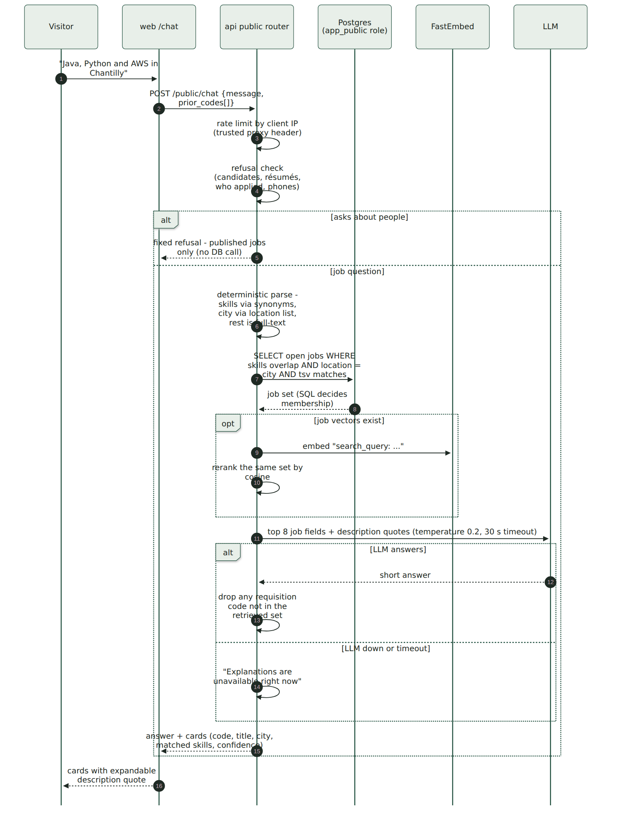

The server keeps no chat history. Follow-ups like “Which of these is senior?” work because the browser sends back `prior_codes[]` from the previous answer. When the model is down, visitors still get job cards, plus the line “Explanations are unavailable right now.”

### 4.3 Admin résumé → ranked jobs

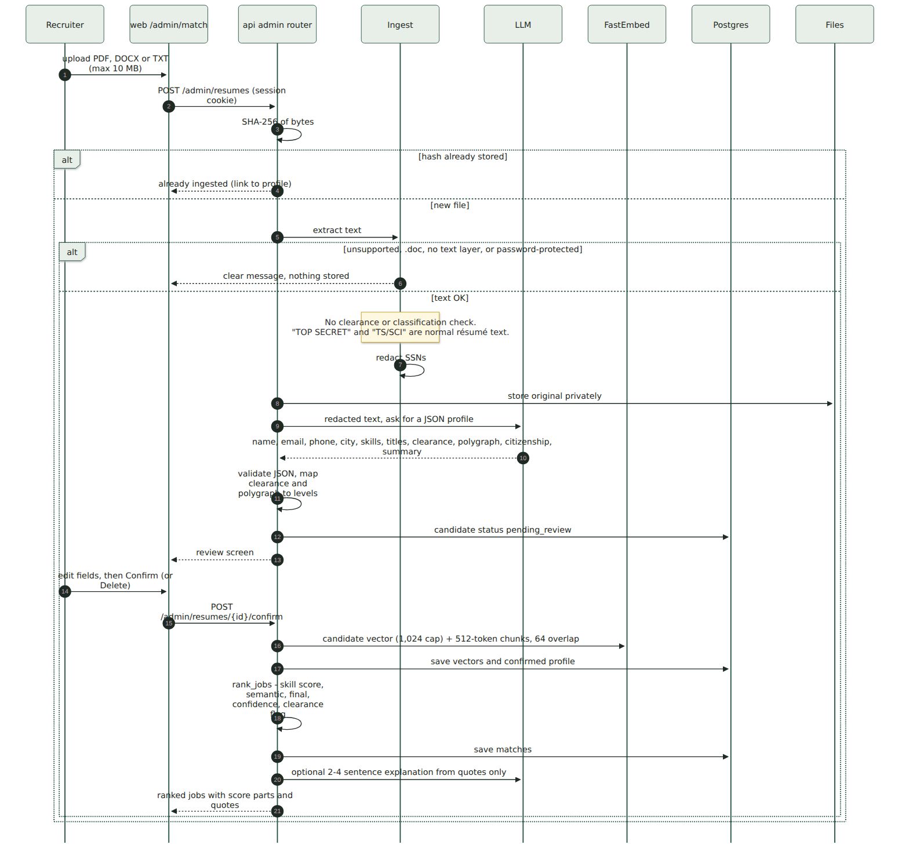

**No résumé is ever rejected for clearance or classification wording.** Nearly every Janus Soft résumé says TOP SECRET or TS/SCI. That text becomes the admin-only `clearance` and `polygraph` levels. Uploads are refused only for technical reasons: unsupported type, legacy `.doc`, no text layer, password protection, or over 10 MB.

The recruiter screens do not rank with the stored blend alone. Match, the job’s candidate list, and Review show **line coverage**: the share of mandatory posting lines the résumé covers, and the same share for desired lines. A card is hidden below 50% mandatory. A strong match is at least 90%. Desired coverage is reported beside that and does not lower the mandatory percent. The rules are in [README.md](README.md) under “How a posting line is scored” and in `SPEC.md` section 5.

Uploading the same file again returns the existing candidate instead of a second copy. Résumé skills shown on the form are tools and languages taken from the file text.

### 4.4 Scoring (code, not prompt)

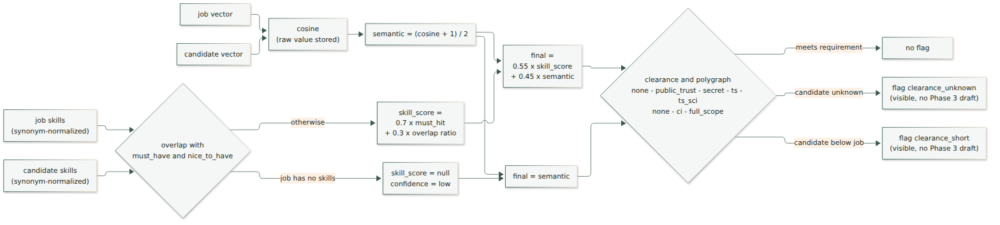

Polygraph is its own scale because nearly every current job requires Full Scope Polygraph. A candidate with TS/SCI but only a CI polygraph gets the `clearance_short` flag on those jobs. Nothing is hidden from the admin.

The stored match row still keeps `skill_score`, `semantic`, and `final` from `SPEC.md` section 5. The percentage a recruiter reads on screen is the line coverage from section 4.3, recomputed from the résumé text and the posting lines.

### 4.5 Review one job against one résumé

`/admin/review` takes a job and a résumé and shows mandatory coverage, desired coverage, the lines that matched, and the lines still missing. The same comparison is linked from each candidate on a job page. A tool named in the job title and absent from the résumé is called out on that screen. The job’s candidate list omits that résumé even when other lines match.

---

## 5. Embedding model and token sizes

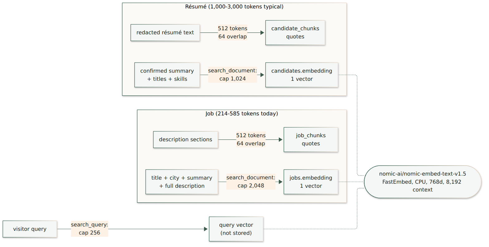

Measured on the live site: job detail pages are **214–585 tokens** (median 363). A two-to-five-page résumé is typically **1,000–3,000 tokens**.

| Model (all FastEmbed, CPU, arm64) | Dimensions | Max input | Fit for this data |
| --- | ---: | ---: | --- |
| **`nomic-ai/nomic-embed-text-v1.5`** (chosen) | 768 | 8,192 | Whole job descriptions and résumé summaries fit in one vector. Apache-2.0, 137M parameters. |
| `jinaai/jina-embeddings-v2-base-en` (allowed alternative) | 768 | 8,192 | Same fit, similar size. |
| `BAAI/bge-base-en-v1.5` (original spec) | 768 | 512 | Cuts the longest job descriptions and most of every résumé; would need 400-token chunks everywhere. |

Chosen sizes (locked in `SPEC.md` section 4):

| What | Max tokens | Chunking |
| --- | ---: | --- |
| Job vector: title + city + summary + full description | 2,048 | none |
| Candidate vector: confirmed summary + titles + skills | 1,024 | none |
| Job and résumé chunks, used as quotes | 512 | 64 overlap, split on section and paragraph boundaries first |
| Visitor query | 256 | none |

Chunks stay at 512 tokens even though the model accepts 8,192: they are the evidence recruiters read, and shorter chunks give tighter quotes and faster CPU embedding on the production instance. All three models are 768-dimensional, so switching needs a re-embed but no schema change. Token counts use the model's own tokenizer. The model is baked into the API image, so container start never depends on Hugging Face.

---

## 6. Data model

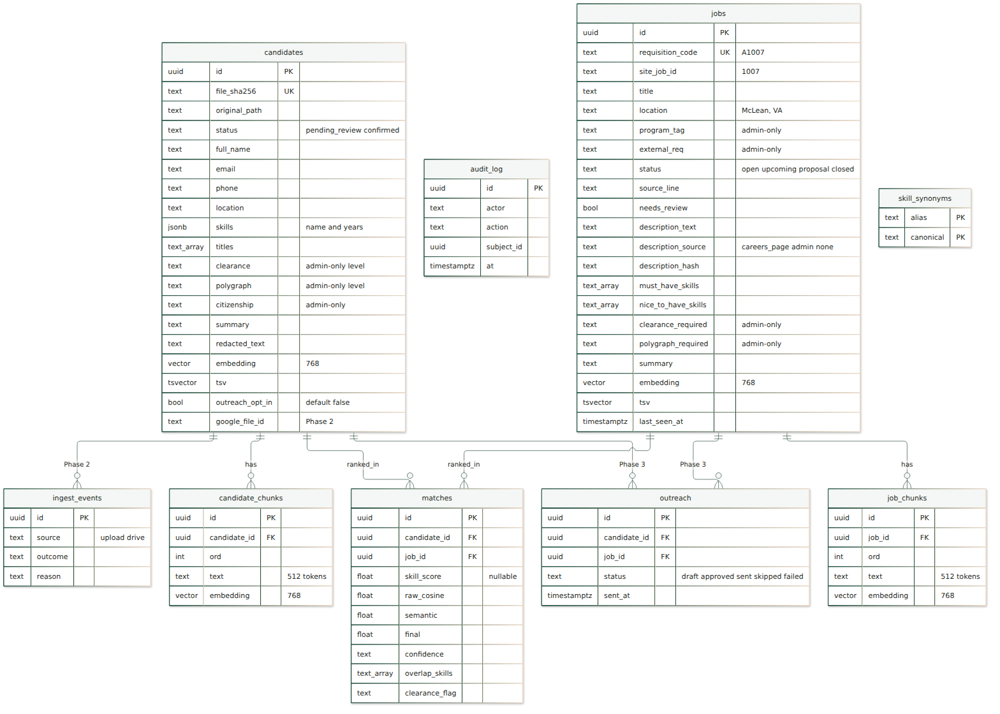

Phase 1 creates every table except `outreach` and `ingest_events`, which arrive in Phases 3 and 2. Migrations use Alembic. The first migration creates the `vector` extension, the two database roles, and HNSW cosine indexes.

---

## 7. Phase 2 — Google Drive ingest

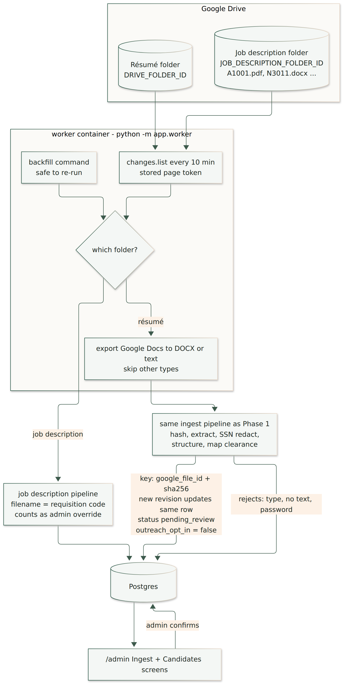

Drive imports run through the Phase 1 pipeline unchanged. They land as `pending_review` with `outreach_opt_in = false`, and join rankings only after an admin confirms them. A new file revision updates the same candidate, keyed on `google_file_id` plus content hash.

---

## 8. Phase 3 — outreach drafts and email

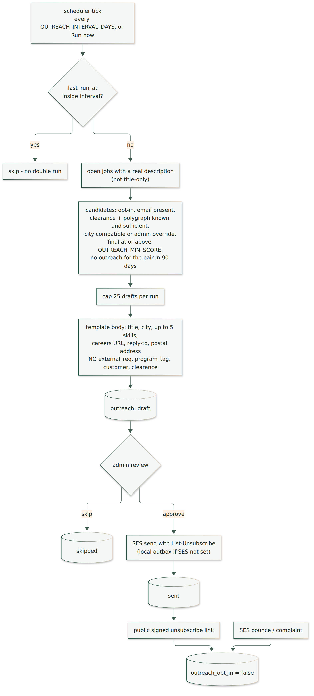

Prerequisites before this phase: SES out of sandbox; `janus-soft.com` verified with SPF, DKIM, and DMARC; bounce and complaint handling; HMAC-signed unsubscribe tokens. Also recalibrate `OUTREACH_MIN_SCORE` on real Phase 1 matches first. Embedding cosines bunch in a narrow band, so the default 0.62 would admit almost everyone.

---

## 9. Deployment

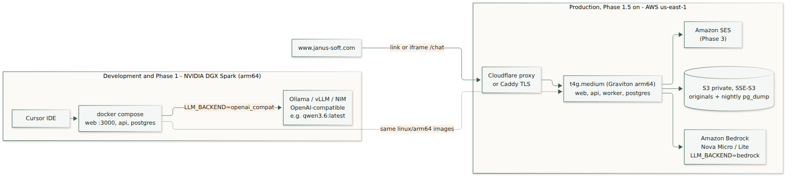

The DGX Spark (Grace) and the AWS Graviton instance are both arm64, so one set of `linux/arm64` images serves development and production. The Next.js bundle is built into the image, not on the 4 GB instance. The public link goes live only after Phase 1.5, so it doesn't depend on the Spark being on.

---

## 10. Review decisions (all folded into SPEC.md)

| Topic | Decision | SPEC section |
| --- | --- | --- |
| Clearance wording | Never rejects a résumé or job description. Parsed into admin-only `clearance` + `polygraph` levels. Operators, not code, keep real classified files out. | 2, 4, 5 |
| Careers source | Listing plus every `/jobs/NNNN` detail page, re-crawled every 6 h and on demand. Listing is authoritative for title and city. Admin override wins over page text. | 3 |
| Crawl safety | Sanity guard; failed detail fetch keeps the old description; closed codes reopen if they return. | 3 |
| Parser edge cases | `Proposal -` / `Upcoming -` prefixes, parenthetical anywhere, spaces in `external_req`, dashed separators, stale detail headings, pages without headings flagged `needs_review`. | 3 |
| Embeddings | `nomic-embed-text-v1.5`, 768d, chunks 512/64, vector caps 2,048 (job) / 1,024 (candidate) / 256 (query). | 2, 4 |
| LLM client | One interface: `openai_compat` in Phase 1 (DGX), `bedrock` Converse in Phase 1.5. Strips think blocks and fences, 30 s timeout, one retry. | 2 |
| Public boundary | `app_public` DB role + import-boundary test + SQL-log test. | 10, 11 |
| SSN | Redacted before DB, logs, LLM request, and embedding. | 2, 4 |
| File types | PDF, DOC, DOCX, TXT up to 10 MB. `.doc` is read with antiword. A file that still cannot be read is listed under Unparsed résumés. | 4 |
| Synonyms | One alias to many canonicals; word-boundary matching; clearance phrases are never skills. Kubernetes and Docker are their own canonicals, not DevOps. CI/CD still maps to DevOps. | 6 |
| Recruiter coverage | Mandatory and desired percents are shares of posting lines. Floor 50%, strong match 90%. Title tools are required. Stored `final` remains the section 5 blend. | 5, 8 |
| Chat state | Stateless server; client sends `prior_codes[]`. | 7 |
| Rate limit | Per IP via `TRUSTED_PROXY_HEADER` behind a proxy. | 7 |
| Admin login | argon2id, per-IP lockout, `app.hashpw` helper, `$$` escaping or hash file. | 8 |
| AWS deploy | New Phase 1.5 with its own acceptance checks. | 11 |
| Drive imports | `pending_review` until confirmed. | 4, 11 |
| Outreach | SES prerequisites and threshold calibration before first send. | 9, 11 |

---

## 11. What Phase 1 contains

Phase 1 is already in this repository. A later chat should read `SPEC.md` and this file and name the phase it will build. It should not rebuild Phase 1 from `PROMPT.md`.

```
talent-chat/
├── docker-compose.yml            # web, api, postgres (linux/arm64)
├── .env.example                  # every variable, secrets blank
├── configs/locations.yaml        # known cities
├── api/                          # FastAPI, Python 3.12, uv
│   ├── app/public/               # search_jobs, get_job - app_public role, no candidate imports
│   ├── app/admin/                # auth, jobs, résumés, rank, review
│   ├── app/core/                 # crawler, parsers, ingest, redact, clearance, embed, score, llm
│   ├── alembic/
│   └── tests/
├── web/                          # Next.js App Router, TypeScript, Tailwind, shadcn/ui
│   ├── app/chat/
│   └── app/admin/                # jobs, match, review, login
├── tests/fixtures/careers/       # live snapshot, 2026-09-27
├── docs/diagrams/                # diagram sources + PNGs
├── scripts/render-diagrams.sh
└── ARCHITECTURE.md  PROMPT.md  README.md  SPEC.md  postgres.md  llm.md  workflow.md  deploy.md  aws_deploy.md
```
