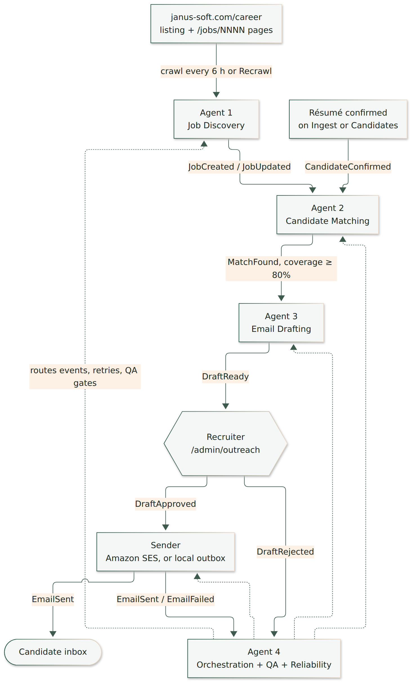
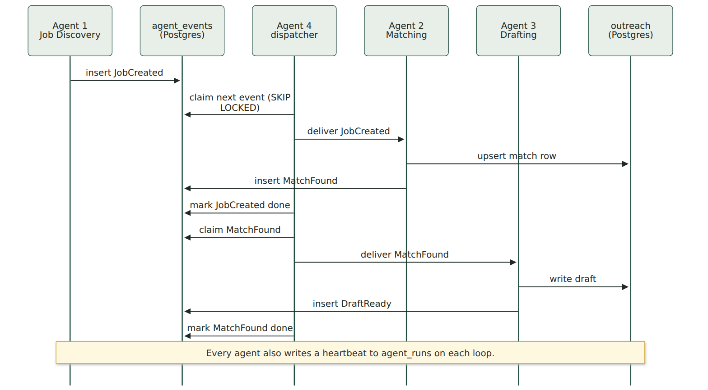
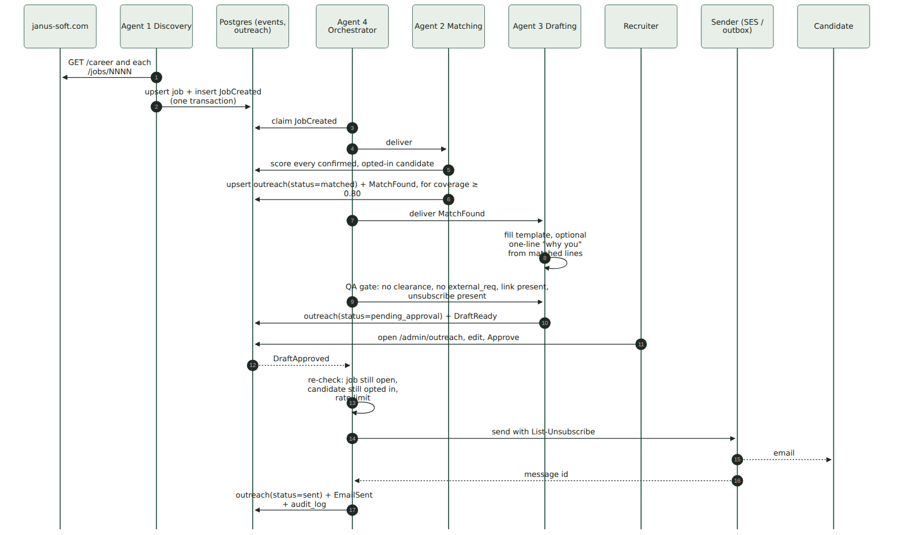
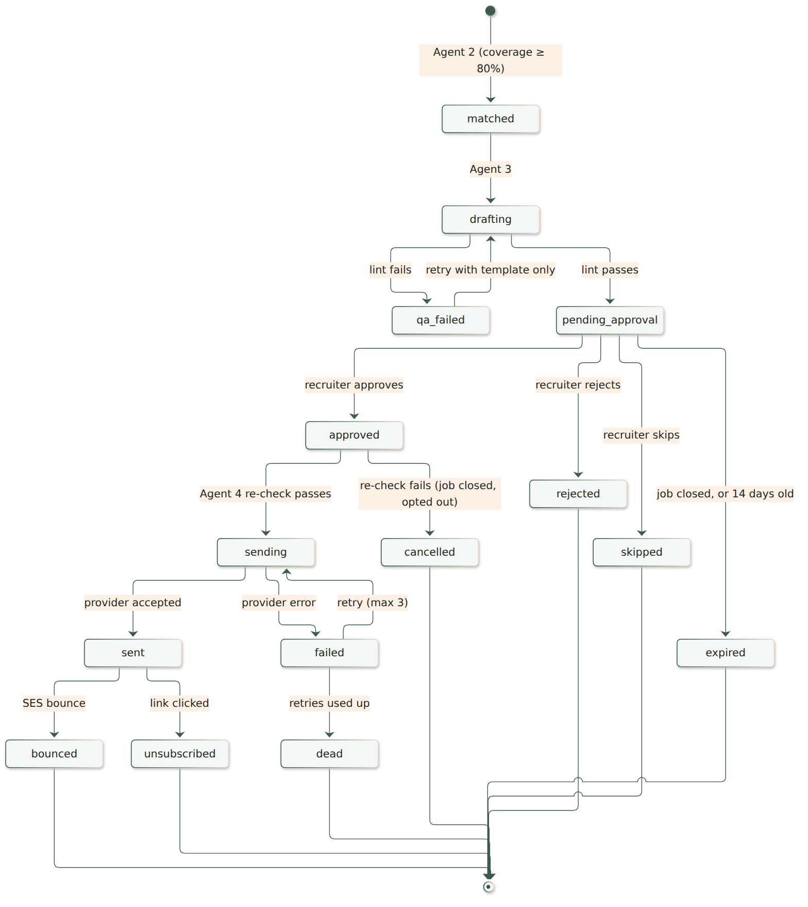
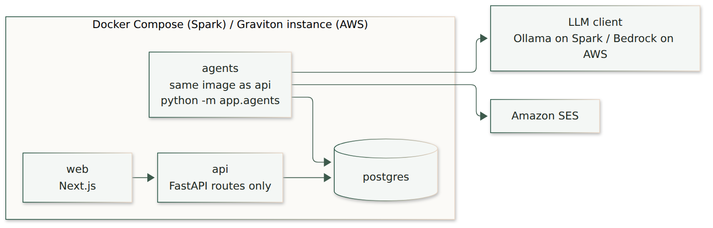

# Outreach agents — design

Status: design only. Nothing in this document is built yet.

This document turns the Phase 3 outreach in [SPEC.md §9](SPEC.md) into four cooperating agents:

1. **Job Discovery** finds new and changed postings.
2. **Candidate Matching** finds people who cover at least 80% of a posting's mandatory lines.
3. **Email Drafting** writes a draft for each match and waits for a recruiter.
4. **Orchestration, QA and Reliability** moves events between the other three, checks every draft and every send, and keeps the pipeline safe to restart.

An "agent" here is a small Python worker with one job, one input event type and one output event type. It is not a multi-agent framework. SPEC.md rules out CrewAI, AutoGen and LangGraph, and this design keeps that rule. The agents share the existing code: the crawler, the line-coverage scorer, the LLM client and Postgres.

---

## 1. The flow



The solid arrows are the happy path from your sketch. The dotted arrows show why Agent 4 sits outside the line. It does not run after Email Sent. It watches every step, from crawl to delivery.

Two triggers start matching:

- A new or changed job, so the new posting reaches people already on file.
- A newly confirmed résumé, so a new person is checked against the jobs already open.

---

## 2. How the agents talk: a Postgres event table

The agents never call each other directly. Each one writes an event row, and Agent 4 hands that row to the next agent. Postgres is already the system of record, so the design adds no Redis, Kafka or SQS.



Rules for every event:

- **Claimed with `FOR UPDATE SKIP LOCKED`.** Two workers can never process the same event.
- **Idempotent.** Each event has a `dedupe_key`, for example `match:<job_id>:<candidate_id>`. A second insert with the same key is ignored, so a crash and replay cannot create a second draft or a second email.
- **Retried with backoff.** Delays are 1 minute, 5 minutes, then 30 minutes. After the third failure the event moves to `dead` and appears on the Outreach page.
- **Written in the same transaction as the change it describes.** A job is never saved without its `JobCreated` event, and the reverse is also true.

### Events

| Event | Written by | Read by | Payload |
| --- | --- | --- | --- |
| `JobCreated` | Agent 1 | Agent 2 | job id |
| `JobUpdated` | Agent 1 | Agent 2 | job id and which fields changed (description, must-have lines) |
| `JobClosed` | Agent 1, or Close on the Jobs page | Agent 4 | job id. Pending drafts for that job expire |
| `CandidateConfirmed` | existing confirm route | Agent 2 | candidate id |
| `MatchFound` | Agent 2 | Agent 3 | outreach id, coverage, matched lines |
| `DraftReady` | Agent 3 | recruiter UI | outreach id |
| `DraftApproved` / `DraftRejected` | recruiter UI | Sender / Agent 4 | outreach id, approver email, edited text |
| `EmailSent` / `EmailFailed` | Sender | Agent 4 | outreach id, provider message id or error |
| `Unsubscribed`, `Bounced`, `Complained` | public unsubscribe route, SES notifications | Agent 4 | candidate id |

---

## 3. End-to-end sequence



---

## 4. The agents

### Agent 1 — Job Discovery

| | |
| --- | --- |
| **Wraps** | `app/core/crawler.py::run_crawl`, unchanged in what it parses |
| **Runs** | Every `CRAWL_INTERVAL_HOURS` (6), and on **Recrawl now** |
| **Emits** | `JobCreated` for a new requisition code. `JobUpdated` when `description_hash` or the must-have lines change. `JobClosed` when a code leaves the listing |
| **Does not emit** | Anything when the crawl sanity guard trips (0 rows, or fewer than half the open jobs). A broken page must not look like 20 closed jobs |
| **Skips** | Jobs with no description, and jobs whose only signal is the title (SPEC §3: "excluded from automatic outreach drafts") |

The only code change is that `run_crawl` returns which codes were created, changed or closed, and inserts the events in the same commit.

### Agent 2 — Candidate Matching

| | |
| --- | --- |
| **Wraps** | The scorer behind the Jobs page and Review: `section_coverage` + `gate_mandatory`, plus the title and role checks from `review_pair` |
| **Input** | `JobCreated` / `JobUpdated`: score all eligible candidates for that job. `CandidateConfirmed`: score that candidate against all open jobs |
| **Score** | **Mandatory line coverage**, the percentage recruiters already see on screen. Threshold `OUTREACH_MIN_COVERAGE = 0.80` |
| **Hard filters** | `outreach_opt_in = true`. Email present. Status `confirmed`. Clearance and polygraph known and sufficient. Location compatible. No `title_missing` or `role_missing` conflict. No outreach row for this pair in the last 90 days. Not on the suppression list |
| **Emits** | `MatchFound`, and upserts `outreach(status=matched)` with coverage, matched lines and missing lines |
| **Cap** | 25 new matches per job per run, highest coverage first. A large ingest cannot flood the queue |

**This is a deliberate change from SPEC §9.** The spec gates on `final ≥ 0.62`, the embedding blend. ARCHITECTURE §8 notes that this number bunches high and would admit almost everyone. Line coverage is explainable ("covers 9 of 11 mandatory lines"), is already on every recruiter screen, and is the 80% in your sketch. `final` is still stored, for calibration.

The model never decides who is matched. Matching is deterministic code, the same as Find and Review today.

### Agent 3 — Email Drafting

| | |
| --- | --- |
| **Input** | `MatchFound` |
| **Template** | SPEC §9 is authoritative. Subject and body come from a template with the job title, city, up to five matched skills, the careers link (`jobs.source_url`), reply-to `contact@janus-soft.com`, the postal address and an unsubscribe link |
| **LLM, optional** | `OUTREACH_LLM_SENTENCE=true` lets the LLM client write **one sentence** on why the role fits. It is given only the matched posting lines and the candidate's first name, never the résumé. If the call fails or the sentence fails QA, the draft ships without it |
| **Never includes** | Clearance or polygraph, `external_req`, `program_tag`, customer names, phone numbers, salary, or skills the person was not matched on |
| **Emits** | `DraftReady`, and sets `outreach.status = pending_approval` |

### Human approval (not an agent)

A new **Outreach** tab on the recruiter desk, next to Jobs.

- Groups the queue by job. Each draft shows the candidate, coverage ("9 of 11 mandatory lines"), the matched and missing lines, and the draft text.
- Actions per draft: **Approve**, **Edit then approve**, **Reject** with a reason, or **Skip** (stays out of the queue for 90 days).
- Bulk approval is allowed for a job, and is still a recruiter click per batch.
- The approver's Google account is stored on the row and in `audit_log`.
- **No automatic sending.** SPEC's per-job "send without approval" flag is left out of this design. Your sketch puts a human on every email, and so does this design.

### Sender

Owned and supervised by Agent 4, but kept small enough to read in one sitting.

| Mode | When | Behaviour |
| --- | --- | --- |
| `outbox` | `SES_FROM_ADDRESS` unset (default on the Spark) | Writes the full MIME message to `data/outbox/` and marks the row `sent (outbox)`. Safe for testing |
| `ses` | `SES_FROM_ADDRESS` set, SES out of sandbox | Amazon SES `SendEmail` with `List-Unsubscribe` and `List-Unsubscribe-Post` headers |

### Agent 4 — Orchestration, QA and Reliability

Agent 4 has three jobs.

**Orchestration**

- The dispatcher loop: claim events, deliver them to the right agent, record the result.
- Applies retry and backoff, and moves an event to `dead` after the third failure.
- Runs a **weekly sweep** (`OUTREACH_INTERVAL_DAYS = 7`) that re-scores open jobs. A missed event, for example during a deploy, is picked up within a week.
- Expires `pending_approval` drafts when their job closes or after 14 days.

**QA gates.** A draft that fails a gate never reaches a recruiter or an inbox.

| Gate | Checked before | Checks |
| --- | --- | --- |
| Draft lint | the approval queue | No clearance or polygraph words, no `external_req` or `program_tag`, the careers link resolves to this job, unsubscribe link and postal address present, no unfilled `{placeholders}`, no skill outside the matched set, length limits |
| Send re-check | every send | Job still open. Candidate still opted in and not suppressed. No email to this pair in 90 days. The approved text is unchanged since approval |
| Rate limit | every send | At most `OUTREACH_MAX_PER_HOUR` (default 20) and `OUTREACH_MAX_PER_DAY` (default 100) messages |
| Anomaly | each run | Alerts and pauses drafting for that job if one job produces more than 3× its usual match count. Usual cause: a bad posting parse |

**Reliability**

- **Kill switch.** A `settings` row, `outreach_paused`, with a toggle on the Outreach page. When it is on, drafting and sending stop, and events queue up.
- **Heartbeats.** Each agent updates `agent_runs` every loop. The dashboard shows each agent as green, amber or red, plus the queue depth and the number of dead events.
- **Crash safety.** Status changes and event inserts share one transaction. A restart re-claims unfinished events. The send step records the provider message id before marking the row `sent`, so a replay cannot send twice.
- **Feedback.** SES bounce and complaint notifications, and the public unsubscribe route, set `outreach_opt_in = false`, add the address to `suppression`, and cancel that person's pending drafts.

---

## 5. One outreach row's life



---

## 6. Data model additions

One Alembic migration, `0004_outreach_agents`. The `app_admin` role gets full access to these tables. `app_public` gets none, except the unsubscribe route, which uses a signed token and a single narrow update.

| Table | Key columns |
| --- | --- |
| `agent_events` | `id`, `type`, `payload jsonb`, `dedupe_key unique`, `status` (`new`/`running`/`done`/`dead`), `attempts`, `available_at`, `last_error`, `created_at` |
| `outreach` | `id`, `job_id`, `candidate_id`, unique (`job_id`, `candidate_id`, `cycle`), `coverage`, `matched_lines`, `missing_lines`, `final`, `status`, `subject`, `body`, `qa_notes`, `approved_by`, `approved_at`, `provider_message_id`, `sent_at`, `error` |
| `agent_runs` | `agent`, `last_heartbeat`, `last_ok`, `last_error`, `processed_total` |
| `suppression` | `email`, `reason` (`unsubscribe`/`bounce`/`complaint`/`manual`), `created_at` |

---

## 7. Where the agents run



- A new `agents` Compose service runs the same image as `api` with a different command. The crawl timer moves out of `api/app/main.py` into this worker, as SPEC §10 already plans ("worker: crawl timer, … outreach timer").
- The API stays fast. The comment in `rank.py` records that model calls held the API worker long enough to time out Find. Agent work never runs inside a request.
- One worker process runs all four agents as asyncio tasks. Scaling to two copies is safe because of `SKIP LOCKED`, but this volume (about 20 jobs and hundreds of résumés) does not need it.

Proposed code layout:

```
api/app/agents/
  __main__.py        # starts the four loops
  events.py          # emit(), claim(), complete(), fail()
  discovery.py       # Agent 1
  matching.py        # Agent 2
  drafting.py        # Agent 3 + templates/
  orchestrator.py    # Agent 4: dispatcher, sweep, expiry, QA gates, rate limit
  sender.py          # outbox + SES
  qa.py              # draft lint and send re-check, pure functions
```

---

## 8. Settings

| Variable | Default | Meaning |
| --- | --- | --- |
| `AGENTS_ENABLED` | `false` | Master switch for the worker |
| `OUTREACH_MIN_COVERAGE` | `0.80` | Mandatory line coverage needed for a match |
| `OUTREACH_COOLDOWN_DAYS` | `90` | No second email to the same person for the same job inside this window |
| `OUTREACH_MAX_DRAFTS_PER_JOB` | `25` | Per run |
| `OUTREACH_INTERVAL_DAYS` | `7` | Safety-net sweep |
| `OUTREACH_DRAFT_TTL_DAYS` | `14` | Pending drafts expire after this |
| `OUTREACH_MAX_PER_HOUR` / `_PER_DAY` | `20` / `100` | Send rate limits |
| `OUTREACH_LLM_SENTENCE` | `false` | Allow the one-sentence "why you" line |
| `SES_FROM_ADDRESS` | empty | Empty writes to the local outbox instead of sending |
| `UNSUBSCRIBE_SECRET` | none | HMAC key for unsubscribe tokens |

---

## 9. Screens that change

| Screen | Change |
| --- | --- |
| **Outreach** (new) | Draft queue by job, approve, edit, reject, skip, bulk approve, kill switch, dead events with Retry |
| **Dashboard** | Agent health tiles (heartbeat, queue depth, dead events) and sent-this-week |
| **Jobs** | A "Matches ≥ 80%" count per job, linking to that job's drafts |
| **Candidates** | Opt-in toggle (already in SPEC §8) and outreach history per person |

---

## 10. Testing

The pattern is the same as `tests/test_phase1_flows.py`: fixture careers pages through `MapFetcher`, and a fake LLM client.

- New fixture job, then crawl: exactly one `JobCreated`. Crawling again creates nothing new.
- A candidate at 9 of 11 mandatory lines (82%) gets a draft. A candidate at 7 of 11 (64%) does not. A candidate who is not opted in does not.
- A draft never contains the fixture `external_req` or the word "clearance". The QA gate rejects one that does.
- Approve in outbox mode writes one MIME file with `List-Unsubscribe`. Replaying the `DraftApproved` event writes nothing new.
- Closing the job expires its pending drafts. Approving after the close cancels the send.
- The unsubscribe link stops future drafts and cancels pending ones.
- The kill switch stops sending, and events resume when it is turned off.
- A crash between claim and complete re-delivers the event and produces one draft, not two.

---

## 11. Rollout

| Step | What turns on | Exit check |
| --- | --- | --- |
| 1 | Events table plus Agents 1 and 2 only, writing `matched` rows | Match list for real jobs reviewed by a recruiter. Tune `OUTREACH_MIN_COVERAGE` |
| 2 | Agent 3 plus the Outreach page, sender in `outbox` mode | A week of drafts read and approved with nothing leaving the building |
| 3 | SES in sandbox, sending to staff addresses | SPF, DKIM, DMARC, bounce and unsubscribe paths proven |
| 4 | SES production, low rate limits | Watch the Dashboard tiles, then raise limits |

---

## 12. Decisions to confirm

1. **Score.** Mandatory line coverage ≥ 80% replaces SPEC's `final ≥ 0.62`. Update SPEC §9 if you agree.
2. **Opt-in.** This design follows SPEC: only `outreach_opt_in = true` candidates are emailed. Today that is nobody, so someone must set opt-in before step 2 produces drafts.
3. **LLM sentence.** Off by default, so drafts stay template-only as SPEC requires. Turn it on only after reviewing samples.
4. **Approval.** Every email needs a human click. SPEC's per-job auto-send flag is dropped.
5. **Worker split.** The crawl timer moves from `api` to the new `agents` service.
