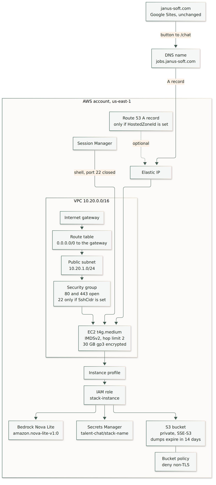
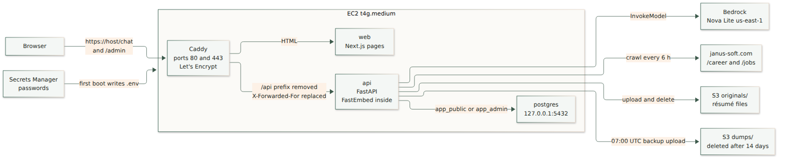

# AWS deployment

What [deploy/cloudformation.yml](deploy/cloudformation.yml) creates in `us-east-1`, and how a browser request moves through it. The Spark stack is separate and stays on Ollama. Commands and the restore drill are in [deploy.md](deploy.md).

Diagrams are PNG images. Sources are in [`docs/diagrams/`](docs/diagrams/). After editing a `.mmd` file, run `scripts/render-diagrams.sh`.

## Resources

The template creates one public subnet and one instance. There is no load balancer and no NAT gateway.

| Name in the template | AWS type | What it is |
| --- | --- | --- |
| `Vpc` | VPC | `10.20.0.0/16` |
| `InternetGateway` | Internet gateway | Path out of the VPC |
| `GatewayAttachment` | Gateway attachment | Connects the gateway to the VPC |
| `PublicSubnet` | Subnet | `10.20.1.0/24`, public |
| `PublicRouteTable` | Route table | Holds the default route |
| `DefaultRoute` | Route | `0.0.0.0/0` to the internet gateway |
| `SubnetRouteAssociation` | Association | Attaches that route table to the subnet |
| `AppSecurityGroup` | Security group | TCP 80 and 443 from the internet. 5432, 3000, and 8000 are closed |
| `SshIngress` | Security group rule | TCP 22, only when `SshCidr` is set |
| `AppEip` | Elastic IP | Stable address for the DNS A record |
| `AppEipAssociation` | EIP association | Attaches that address to the instance |
| `AppInstance` | EC2 instance | `t4g.medium`, Amazon Linux 2023 arm64, IMDSv2, metadata hop limit 2, 30 GB gp3 encrypted |
| `InstanceProfile` | Instance profile | Attaches the role to the instance |
| `AppRole` | IAM role | `bedrock:InvokeModel` on Nova Lite, S3 objects under `originals/` and `dumps/`, and the app secret |
| `FilesBucket` | S3 bucket | Private, SSE-S3, ACLs disabled. `dumps/` expires after 14 days. Kept if the stack is deleted |
| `FilesBucketPolicy` | Bucket policy | Denies any request that is not TLS |
| `AppSecret` | Secrets Manager | `talent-chat/<stack-name>`. Recruiter password and database passwords. Kept if the stack is deleted |
| `DnsRecord` | Route 53 A record | Only when `HostedZoneId` is set. Otherwise you create the A record yourself |

These are used and are not created by the template:

| Service | How it is used |
| --- | --- |
| Amazon Bedrock | Nova Lite, model id `amazon.nova-lite-v1:0`, in `us-east-1`. Enable model access in the console before explanations will succeed |
| Systems Manager Session Manager | Shell on the instance while port 22 stays closed. The role includes `AmazonSSMManagedInstanceCore` |
| Let's Encrypt | Caddy, on the instance, requests the certificate for `PublicHost` |
| An existing DNS zone | Required only if you pass `HostedZoneId`. The template does not create a hosted zone |
| GitHub | First boot clones the repo. That clone is not an AWS resource |

`www.janus-soft.com` stays on Google Sites. The careers page gets a button to `https://<PublicHost>/chat`.

## Request flow

Caddy is the only process with a published port. The browser still calls `/api/...` on the public host. Caddy removes the `/api` prefix, replaces `X-Forwarded-For` with the visitor address, and forwards to FastAPI. Next.js pages stay on the `web` container.

| Who | Path | What happens |
| --- | --- | --- |
| Visitor | `https://<host>/chat` | Caddy serves the Next.js page, then `POST /api/public/chat`. The API uses the `app_public` database role, FastEmbed inside the API process, and Bedrock for the paragraph |
| Recruiter | `https://<host>/admin` | Same host and the `admin_session` cookie. Routes use `app_admin`. A résumé upload is stored at `s3://<bucket>/originals/<sha256>` |
| Careers crawl | timer inside `api` | Every 6 hours, and when a recruiter clicks Recrawl. The API fetches `janus-soft.com` and asks Bedrock to structure new descriptions |
| Backup | cron on the instance, 07:00 UTC | `pg_dump` from Postgres, then the API uploads `dumps/talent-<timestamp>.dump`. The bucket lifecycle deletes that prefix after 14 days |
| First boot | user data | Clones the repo, writes passwords into Secrets Manager and `.env`, builds the images, starts Compose |

Bedrock errors still return job cards. The notice is “Explanations are unavailable right now.” FastEmbed does not call AWS.

Postgres listens on `127.0.0.1:5432` inside the instance. The security group does not allow it from the internet.
