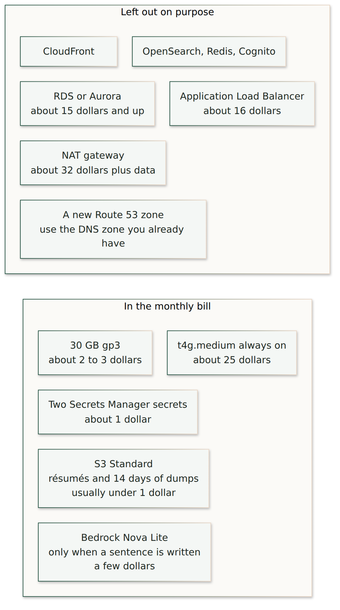

# What this deployment costs

The template is already the small shape. A load balancer, a NAT gateway, a managed database, and a new DNS zone were left out because each one costs more than the server. The pictures and the table below are planning figures for `us-east-1` on-demand prices, not a quote.

## Monthly bill for this stack

| Piece | About | Why this size |
| --- | --- | --- |
| `t4g.medium`, always on | $25 | 4 GB of memory. Postgres, Next.js, Caddy, and the embedding model share the machine. A `t4g.small` has 2 GB and will run out of memory once the embedding model is loaded. `InstanceType` can be `t4g.large` (8 GB, about $50), `t4g.xlarge` (16 GB, about $100), or `t4g.2xlarge` (32 GB, about $200) |
| 30 GB gp3, encrypted | $2–3 | The first boot builds the images on the instance. 20 GB is tight during that build. Afterward the disk holds the images and Postgres |
| Elastic IP | $0 while attached | It becomes about $3.60 a month only if the instance is stopped and the address is left allocated. Leave the instance running, or release the address when you stop it |
| Two Secrets Manager secrets | about $0.80 | One for database passwords, one for the Google client. Merging them would save about forty cents and would make first boot overwrite the Google client |
| S3 Standard | usually under $1 | Résumé originals, the inbox, and 14 days of database dumps. Versioning is off, so a replaced file does not leave a second copy |
| Bedrock Nova Lite, on-demand | a few dollars | Charged per request, and only for the written sentence. Job cards do not call the model. The model id is `amazon.nova-lite-v1:0` in `us-east-1`, not the US geo profile, so the call is not routed to another region |
| Data transfer | small at this volume | The careers crawl is a few pages every 6 hours. Drive downloads arrive as ordinary inbound traffic |

A quiet month is about **$30–40** before Bedrock. With normal recruiter use of the written answers, plan on **about $35–50**. The product ceiling remains $300.

## Left out on purpose

| Omitted | What it would add | Why it is not here |
| --- | --- | --- |
| Application Load Balancer | about $16 a month plus capacity units | One server does not need a load balancer. Caddy terminates TLS |
| NAT gateway | about $32 a month plus $0.045 per GB | The server is in a public subnet and reaches the internet through the internet gateway |
| RDS or Aurora | about $15 and up | Postgres runs on the same instance, bound to localhost |
| A new Route 53 hosted zone | $0.50 a month, plus the risk of moving mail | Add one A record in the DNS zone that already serves `janus-soft.com`. Leave `HostedZoneId` empty |
| CloudFront | another distribution and a second certificate | Visitors are few, and the server is already in `us-east-1` |
| Cognito | a user pool and a monthly active-user charge | Google sign-in is the OAuth client in Google Cloud. The app checks `@janus-soft.com` itself |
| OpenSearch, Redis, a second embedding API | the largest line items in a search stack | Postgres full-text search and pgvector, with FastEmbed inside the API process |
| Detailed CloudWatch monitoring | extra metrics | Docker logs stay on the instance disk |
| S3 versioning or Intelligent-Tiering | monitoring fees and extra copies | The bucket is small. Standard storage is the cheaper class at this size |
| A GPU, or a larger model | the bill moves from a few dollars to hundreds | Nova Lite writes two to four sentences. Search does not use it |

## Habits that keep the bill here

- Leave `SshCidr` empty. Session Manager is the shell. An open SSH port does not cost money, and it is still closed.
- Do not enable Bedrock provisioned throughput. On-demand Nova Lite matches this volume.
- Do not turn on S3 versioning.
- Delete `dumps/` yourself only if you need the space sooner. The lifecycle rule already removes them after 14 days, and incomplete multipart uploads are aborted after 7 days.
- `DeployMode=dev` deletes the instance, the bucket, and both secrets with the stack. Secrets go immediately, with no 30-day name lock. A non-empty bucket still blocks that delete until you empty it.
- `DeployMode=prod` keeps the instance, the bucket, and both secrets. A secret deleted by hand can be restored for 30 days. The root disk stays if the instance is terminated. That is the setting for the site you intend to keep.
- A one-year Compute Savings Plan on the instance type you actually run is the next discount, after the site has stayed up for a month. It is not required to launch.

## What would make it expensive

Moving Postgres to RDS, putting a load balancer or NAT gateway in front, calling a larger Bedrock model for every keystroke, or embedding the chat inside a second CDN. None of those are in the template. The public chat path calls Bedrock once per question, after the cards are already chosen, and skips that call when the visitor only needed the cards.
