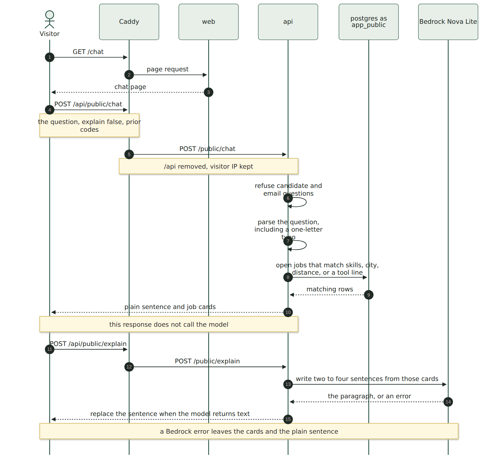
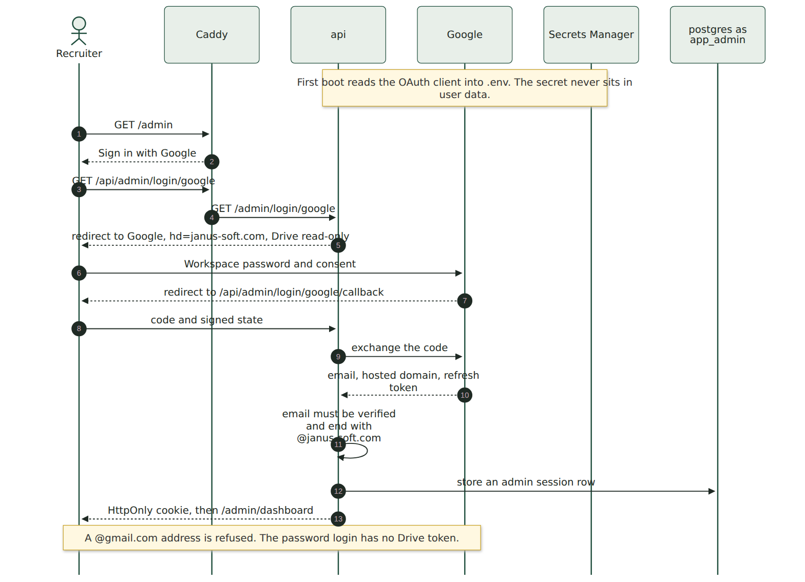
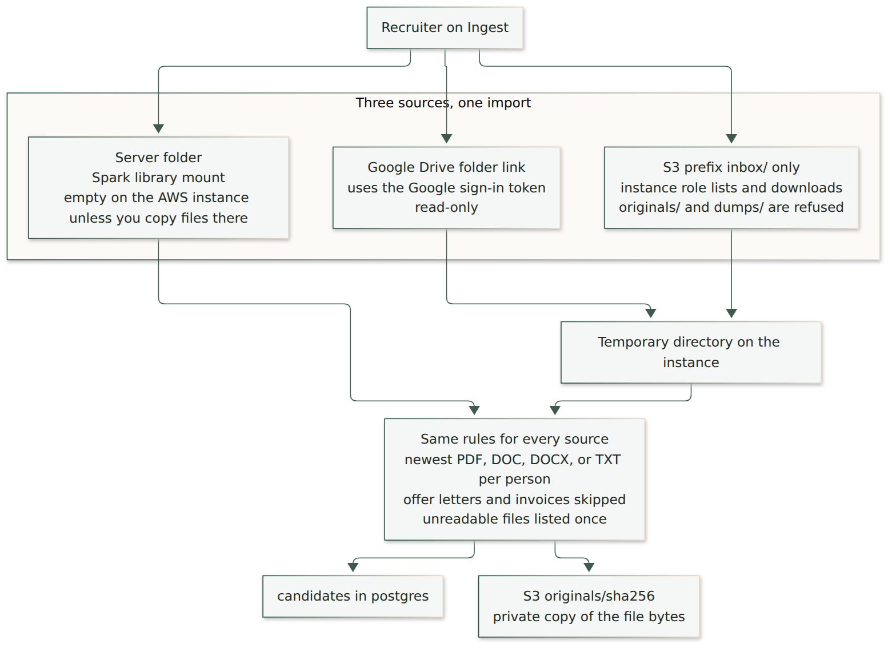

# How a request becomes an answer

The public site is one server. The browser never talks to Postgres, Bedrock, or Drive directly. Caddy is the front door. The pictures match [deploy/cloudformation.yml](../deploy/cloudformation.yml) and the containers in [docker-compose.prod.yml](../docker-compose.prod.yml).

## A visitor asks a question

1. The visitor opens `https://chat.janus-soft.com/chat`. Caddy serves the Next.js page.
2. The question is `POST /api/public/chat`. Caddy forwards it to FastAPI as `POST /public/chat`.
3. Questions about candidates or email addresses are refused before any database call.
4. The API parses the question itself. A one-letter slip such as “withing” is repaired here. The model does not choose the filter.
5. Postgres, as `app_public`, returns the open jobs that match. A tool question such as “Machine Learning” or “Spring Boot” matches the posting line that names it, including a related wording such as AI/ML or Spring Framework.
6. The page shows a plain sentence and the cards immediately.
7. Bedrock Nova Lite may replace that sentence with a short explanation. If Bedrock is down, the cards stay and the notice says explanations are unavailable.

The server does not store the chat. A follow-up works because the browser sends the requisition codes from the previous answer.

A distance question such as “within 30 miles of Bethesda” uses the city coordinates in `configs/locations.yaml`. The cards show the miles. Every current work site is in Northern Virginia, so a 30-mile radius includes them and a 10-mile radius keeps McLean and Tysons.

## A recruiter signs in

1. The recruiter opens `https://chat.janus-soft.com/admin` and chooses **Sign in with Google**.
2. Google sees an Internal OAuth client and the hosted-domain hint `janus-soft.com`.
3. The callback checks that the email is verified and ends with `@janus-soft.com`. A personal Gmail address is refused.
4. The API stores a session row and sets an HttpOnly cookie. The cookie also carries the Drive refresh token from that consent.
5. The break-glass password in Secrets Manager still signs in. That session can use the server folder and the S3 inbox. It cannot read Drive, because there is no Google token.

Do not link `/admin` from the public careers page. The careers page gets a button to `/chat` that opens in a new tab. An iframe on the Google Site blocks the sign-in cookie.

## Three ways a résumé gets in

All three sources end in the same import. It keeps the newest PDF, DOC, DOCX, or TXT for each person, skips offer letters and invoices, and lists a file it could not read once under Unparsed résumés.

| Source | What the recruiter does | What the server does |
| --- | --- | --- |
| Google Drive | Signs in with Google, pastes a folder link, checks, then starts | Downloads that folder with the recruiter’s token into a temporary directory. Read-only. Shared Drives work when that account can open them |
| Amazon S3 | Copies files to `s3://<bucket>/inbox/` with their own AWS credentials, then chooses Amazon S3 on Ingest | The instance role lists and downloads `inbox/` only |
| Server folder | Points at a path on the machine, such as the Spark résumé library | Reads that directory in place. On the AWS instance this disk is empty unless you copy files onto it |

Drive and S3 copies are deleted from the temporary directory when the import finishes. The accepted résumé bytes are stored again under `originals/` as the private original. Nothing in Drive is edited or deleted. A file landing in Drive does not email that person.

## Jobs, backup, and first boot

| Flow | When | What happens |
| --- | --- | --- |
| Careers crawl | Every 6 hours, and when a recruiter clicks Recrawl | The API fetches `www.janus-soft.com/career` and each job page. A new description is structured with Nova Lite. An admin’s saved description is not overwritten. A job closed by hand stays closed |
| Backup | 07:00 UTC | `pg_dump` from Postgres, then `dumps/talent-<timestamp>.dump`. The lifecycle rule deletes that prefix after 14 days |
| First boot | Once, from instance user data | Install Docker, clone `GitRef`, read both secrets, build the images, start Compose, signal CloudFormation |

The public role used by chat cannot see the candidate rows written by an import.
