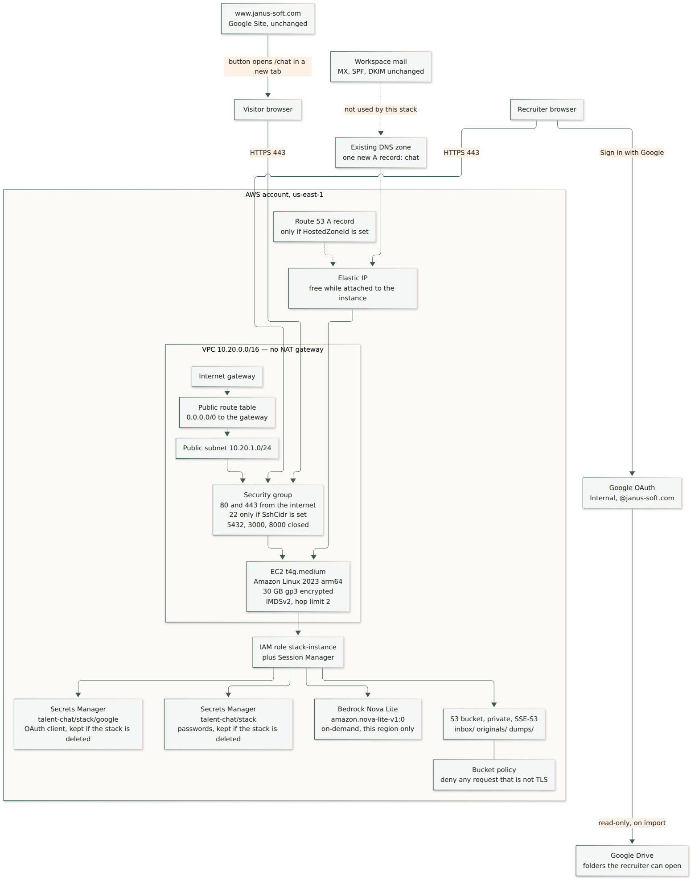
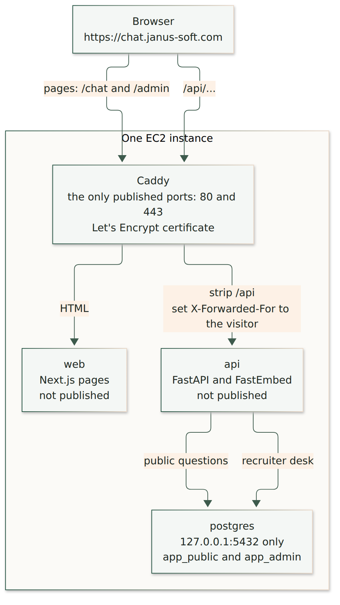

# What the CloudFormation stack creates

Source template: [deploy/cloudformation.yml](../deploy/cloudformation.yml). Region: `us-east-1` only. The stack refuses to create anywhere else, so the Nova Lite call and the résumé bucket stay in the same region.

Diagram sources are in [docs/diagrams/](diagrams/). The pictures below are rendered from those files.

## Created by the template

| Template name | AWS resource | Why it exists |
| --- | --- | --- |
| `Vpc` | VPC `10.20.0.0/16` | A private network for the one server |
| `InternetGateway`, `GatewayAttachment` | Internet gateway | The server can reach the internet, and visitors can reach it |
| `PublicSubnet` | Subnet `10.20.1.0/24` | The server sits here. There is no private subnet |
| `PublicRouteTable`, `DefaultRoute`, `SubnetRouteAssociation` | Route `0.0.0.0/0` to the gateway | Outbound traffic goes straight out. No NAT gateway |
| `AppSecurityGroup` | Security group | TCP 80 and 443 from the internet. Postgres `5432`, the web port `3000`, and the API port `8000` are closed |
| `SshIngress` | Extra rule | Created only when `SshCidr` is set. Leave it empty and use Session Manager |
| `AppInstance` | `InstanceType`, default `t4g.medium`, Amazon Linux 2023 arm64 | Runs every container. 30 GB encrypted gp3. IMDSv2 with hop limit 2 so Docker can see the instance role. `t4g.large` is 8 GB, `t4g.xlarge` is 16 GB, `t4g.2xlarge` is 32 GB. Dev deletes it with the stack. Prod keeps it. Changing the size replaces the instance |
| `AppEip`, `AppEipAssociation` | Elastic IP | A stable address for the `chat` DNS record. Free while it is attached to this running instance |
| `InstanceProfile`, `AppRole` | IAM role | Nova Lite, the two secrets, and S3 under `inbox/`, `originals/`, and `dumps/`. Also Session Manager |
| `FilesBucket`, `FilesBucketPolicy` | S3 bucket | Private, SSE-S3, public access blocked, TLS required. `dumps/` expires after 14 days. Incomplete multipart uploads abort after 7 days. Dev deletes it with the stack when it is empty. Prod keeps it |
| `AppSecret` | Secrets Manager | Database passwords and the break-glass recruiter password. Written on first boot. Dev deletes it with the stack. The name stays reserved for 30 days. Prod keeps it |
| `GoogleOAuthSecret` | Secrets Manager | Google OAuth client id and secret. Same dev and prod rules as `AppSecret`. Not copied into instance user data |
| `DnsRecord` | Route 53 A record | Created only when `HostedZoneId` is set. Janus Soft DNS stays where it is, so leave this empty |

First boot clones the git repo, reads both secrets, writes `.env`, builds the images, and starts Compose. The stack waits up to 60 minutes for that signal.

## Not created by the template

| Thing | Where it comes from |
| --- | --- |
| Google OAuth client | Google Cloud, consent screen set to Internal |
| Drive files | The recruiter’s Google account, read at import time |
| `www.janus-soft.com` | The existing Google Site |
| Workspace mail | Existing MX, SPF, DKIM, and DMARC records |
| The `chat` A record | One record you add in the DNS zone you already have |
| TLS certificate | Caddy requests it from Let’s Encrypt after DNS points at the Elastic IP |
| Nova Lite model access | You enable it once in the Bedrock console for `us-east-1` |

## What runs on the instance

Caddy is the only process with a published port. The browser still calls `/api/...` on `chat.janus-soft.com`. Caddy removes the `/api` prefix and replaces `X-Forwarded-For` with the visitor’s address, so the 30-questions-per-hour limit counts visitors and not Caddy.

Postgres listens on `127.0.0.1` inside the instance. Public chat connects as `app_public`, which can read jobs and cannot read candidates. The recruiter desk connects as `app_admin`.

## S3 prefixes

| Prefix | Who writes it | Who reads it |
| --- | --- | --- |
| `inbox/` | You, with your own AWS credentials, before an import | The instance role, when a recruiter chooses Amazon S3 on Ingest |
| `originals/` | The API, after a résumé is accepted | The API, when a recruiter opens the stored file |
| `dumps/` | The nightly backup | You, during a restore. Objects expire after 14 days |

An import that asks for `originals/` or `dumps/` is rejected. Those prefixes are not a second inbox.
