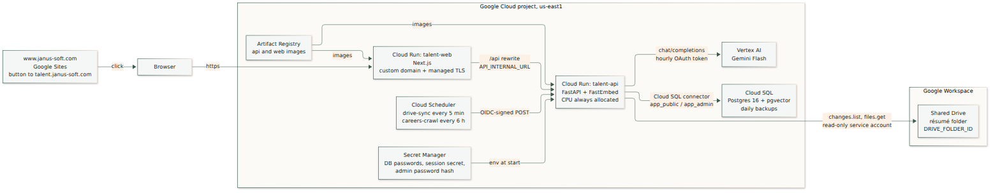
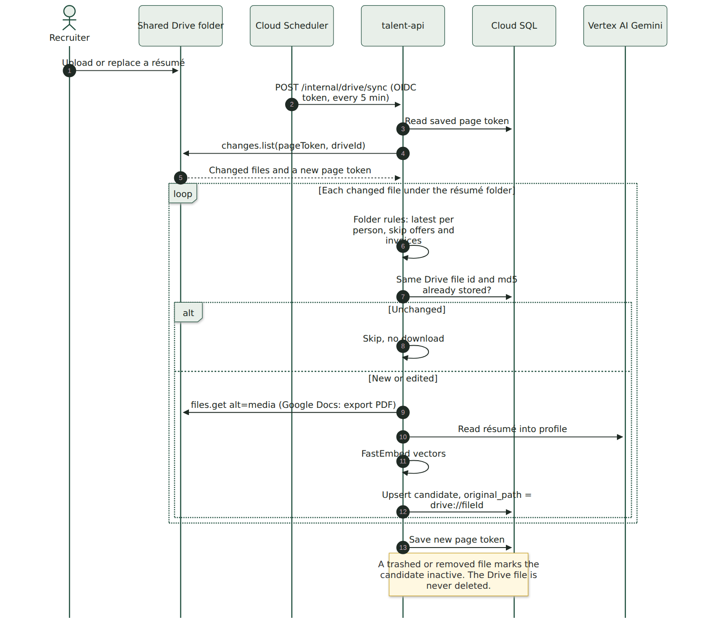
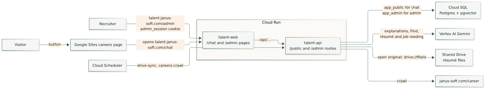

# Google deployment (proposed)

A design for running Talent Chat on Google Cloud next to the Janus Workspace, with résumés imported automatically from a Shared Drive folder. It replaces the AWS plan in [aws_deploy.md](aws_deploy.md). Nothing here is built yet. The code changes it needs are listed under [What has to be built](#what-has-to-be-built).

Diagrams are PNG images. Sources are in [`docs/diagrams/`](docs/diagrams/). After editing a `.mmd` file, run `scripts/render-diagrams.sh`.

## Why Google instead of AWS

- The résumés already live in a Google Shared Drive. The app reads them where they are, so there is no second copy in S3 and no local file store.
- `www.janus-soft.com` is a Google Site. The careers page gets a button to the app.
- One vendor for identity, files, hosting, and the model. Vertex AI does not train on the prompts, and the résumés stay inside Google.
- The app code stays as it is. Both containers move to Cloud Run, Postgres moves to Cloud SQL, and the model becomes Gemini on Vertex AI. Embeddings stay on FastEmbed inside the API, so no vectors are recomputed.

## Resources

One Google Cloud project in `us-east1`. `us-east1` supports Cloud Run custom domain mapping, so no load balancer is needed.

| Resource | What it is | Setting |
| --- | --- | --- |
| Cloud Run `talent-web` | Next.js pages | Public. Custom domain `talent.janus-soft.com` with a Google-managed certificate. `API_INTERNAL_URL` set when the image is built |
| Cloud Run `talent-api` | FastAPI, FastEmbed inside | 1 vCPU, 2 GiB, min 0, max 2 instances. CPU always allocated (see [Cloud Run notes](#cloud-run-notes)). Runs as the `talent-api` service account |
| Cloud SQL `talent-db` | Postgres 16 with `pgvector` | Smallest shared-core tier to start. Daily automated backups, 7 kept. Private to the project; Cloud Run connects through the built-in Cloud SQL connector |
| Vertex AI | Gemini Flash | Called through Vertex's OpenAI-compatible `chat/completions` endpoint |
| Cloud Scheduler | Two timers | `drive-sync` every 5 minutes and `careers-crawl` every 6 hours. Each calls the API with a Google-signed OIDC token |
| Secret Manager | Secrets | Database passwords, `SESSION_SECRET`, `ADMIN_PASSWORD_HASH`. Mounted as environment variables |
| Artifact Registry | Images | `api` and `web`, built by Cloud Build as `linux/amd64` |
| Service account `talent-api` | App identity | `roles/cloudsql.client`, `roles/aiplatform.user`, `roles/secretmanager.secretAccessor`. Viewer on the Shared Drive. No key file in the cloud |
| Service account `talent-scheduler` | Scheduler identity | `roles/run.invoker` on `talent-api` only |

These are used and are not created in the project:

| Service | How it is used |
| --- | --- |
| Google Workspace Shared Drive | Holds the résumés. `talent-api` is added as a Viewer member |
| DNS for `janus-soft.com` | One CNAME: `talent` to `ghs.googlehosted.com` |
| Google Sites | The careers page button |
| `www.janus-soft.com/career` | Still crawled for open jobs |

## Automatic résumé import from Drive

A recruiter drops a résumé into the Shared Drive folder. Within 5 minutes it is a candidate in the app.

**How it works**

1. Cloud Scheduler calls `POST /internal/drive/sync` every 5 minutes. The API accepts only an OIDC token signed for the `talent-scheduler` account.
2. The API asks Drive for everything that changed since the last run (`changes.list` with the saved page token, scoped to the Shared Drive). Drive returns the changed files and a new token.
3. Files outside `DRIVE_FOLDER_ID` are ignored. Files inside go through the same rules as the folder import today: the latest résumé per person, and no offer letters, invoices, or legacy `.doc` files.
4. A file whose Drive id and MD5 checksum are already stored is skipped without downloading.
5. New or edited files are downloaded. A Google Doc is exported as PDF. Each file is read into a profile by the model, embedded with FastEmbed, and saved. The candidate keeps `original_path = drive://<fileId>`.
6. The new page token is saved only after the batch succeeds, so a failed run is retried on the next tick.

The first run has no page token. It walks the whole folder once, the same way the current folder import does, then saves a starting token.

A file that is trashed or removed from the folder flags the candidate for review. The app never deletes or edits anything in Drive, and its access is read-only.

**Why a 5-minute check instead of push notifications**

Drive push notifications expire (at most a week for the changes feed), must be renewed, and can be dropped. A 5-minute check with a saved token is simpler and never misses a file. The same sync code can be triggered by a push notification later if a faster reaction is needed.

Apps Script was considered and not chosen. It has no trigger for "file added to a folder", so it would also end up polling.

**Setup in Workspace**

1. Enable the Google Drive API in the Cloud project.
2. In the Shared Drive, add `talent-api@<project>.iam.gserviceaccount.com` as a **Viewer**.
3. If Workspace blocks sharing with accounts outside `janus-soft.com`, a Workspace admin allows it for this Shared Drive, or adds the service account to the allowlist. Service accounts count as outside the domain.
4. Set `DRIVE_ID` (the Shared Drive) and `DRIVE_FOLDER_ID` (the résumé folder) on `talent-api`.

On the DGX Spark, the same code runs with Application Default Credentials, for example `gcloud auth application-default login --impersonate-service-account=talent-api@<project>.iam.gserviceaccount.com --scopes=https://www.googleapis.com/auth/drive.readonly,https://www.googleapis.com/auth/cloud-platform`. No key file goes into the repo or the image.

## Request flow

| Who | Path | What happens |
| --- | --- | --- |
| Visitor | Careers page button, then `https://talent.janus-soft.com/chat` | `talent-web` serves the page and forwards `/api/public/chat` to `talent-api`. The API uses the `app_public` role, FastEmbed, and Gemini for the explanation |
| Recruiter | `https://talent.janus-soft.com/admin` | Same host and the `admin_session` cookie. Routes use `app_admin`. "Open original" links to the file in Drive, which Drive opens only for people who already have access |
| Drive sync | Cloud Scheduler, every 5 minutes | Described above |
| Careers crawl | Cloud Scheduler, every 6 hours, or Recrawl in the admin | Fetches `janus-soft.com/career` and asks Gemini to structure new descriptions |
| Backup | Cloud SQL, daily | Automated backups and point-in-time recovery replace the `pg_dump` cron job |

## The Google Sites button

Use a button, not an embed. In Google Sites, open the careers page, choose **Insert**, then **Button**. Name it, for example, "Ask about our open jobs", and set the link to `https://talent.janus-soft.com/chat`. Google Sites opens it in a new tab.

An embed is possible but not recommended. Google Sites puts embedded pages in a sandboxed frame on another domain. Browsers block the login cookie there, the chat gets a small fixed box, and the admin pages would not work. `PUBLIC_FRAME_ANCESTOR` stays empty.

## Cloud Run notes

- **Timers move out of the process.** Cloud Run stops idle instances, so the crawl loop in `main.py` would not run reliably. Set `CRAWL_INTERVAL_HOURS=0` and let Cloud Scheduler call the crawl instead.
- **Background work needs CPU after the response.** Saving a job description returns at once and reads it with the model afterward. With request-based billing Cloud Run throttles the CPU after the response, and that step would stall. Use instance-based billing ("CPU always allocated") on `talent-api`. The 5-minute Drive check keeps one instance warm during the day, which is the main running cost.
- **Build for `linux/amd64`.** The Spark builds `arm64` images. Use Cloud Build, or `docker buildx build --platform linux/amd64`.
- **`API_INTERNAL_URL` is read when the web image is built.** Next.js writes rewrites into the build output. Pass the `talent-api` URL as a build argument.
- **Memory.** FastEmbed loads the embedding model at start. 2 GiB is enough. Cold start is a few seconds because the model is baked into the image.
- **The Vertex token expires every hour.** Vertex's OpenAI-compatible endpoint takes a Google OAuth access token, not a fixed key. The client refreshes it from the service account.

## What has to be built

| Area | Change | Size |
| --- | --- | --- |
| `app/core/drive.py` (new) | Drive client: list changes, walk a folder, download or export a file | Medium |
| `app/admin/folder_ingest.py` | Split the selection rules from the local filesystem so they also run on a Drive listing | Small |
| `app/drive_sync.py` (new) and `POST /internal/drive/sync` | First full walk, then the changes feed. OIDC check on the route | Medium |
| Migration `0003` | `drive_sync_state` table (drive id, page token, last run, last error). `candidates.drive_file_id` and `drive_md5` | Small |
| `candidate_repository.py` | Deleting a candidate never touches a `drive://` original | Tiny |
| Admin candidate page | "Open original" links to `https://drive.google.com/file/d/<id>/view` | Tiny |
| `app/core/llm.py` | `vertex` backend: the OpenAI-compatible client with a refreshing Google token. Send `think` only to Ollama | Small |
| `main.py` and a `POST /internal/crawl` route | Crawl triggered by Cloud Scheduler | Small |
| `deploy/gcp/` (new) | `gcloud` script for the project, Cloud SQL roles and `CREATE EXTENSION vector`, both Cloud Run services, scheduler jobs, and the domain mapping | Medium |
| `pyproject.toml` | `google-api-python-client`, `google-auth` | Tiny |

Unused after the move: `S3FileStore`, `BedrockClient`, `deploy/cloudformation.yml`, and the Caddy files. They can stay until the AWS plan is formally dropped.

## Moving from the Spark

1. Create the project and enable Cloud Run, Cloud SQL Admin, Vertex AI, Drive, Cloud Scheduler, Secret Manager, Artifact Registry, and Cloud Build.
2. Create `talent-db`, the `talent` database, `CREATE EXTENSION vector`, and the `app_admin`, `app_public`, and migration roles.
3. `pg_dump` the Spark database and restore it into Cloud SQL through the Cloud SQL Auth Proxy. The stored FastEmbed vectors carry over unchanged.
4. Build both images with Cloud Build and deploy `talent-api`, then `talent-web`.
5. Map `talent.janus-soft.com` to `talent-web` and add the CNAME.
6. Share the Shared Drive with `talent-api`, then create the two Cloud Scheduler jobs.
7. Run one Drive sync by hand and check the candidate count against the folder.
8. Add the button on the Google Site.

The Spark stays the development and test machine, still on Ollama.

## Rough monthly cost

| Item | Estimate |
| --- | --- |
| Cloud SQL, smallest shared-core tier, 10 GB | About $10–30 |
| Cloud Run `talent-api`, instance-based billing, one instance warm during the day | About $30–60 |
| Cloud Run `talent-web`, request-based | A few dollars |
| Gemini Flash on Vertex AI | A few dollars at recruiting volumes |
| Scheduler, Secret Manager, Artifact Registry | Under $5 |

Checking Drive every 15 minutes during business hours instead of every 5 minutes around the clock lowers the Cloud Run cost.

## Later

- Replace the admin password with "Sign in with Google", limited to `@janus-soft.com`.
- Trigger the Drive sync from a push notification for a faster reaction.
- Job descriptions from a second Drive folder (`JOB_DESCRIPTION_FOLDER_ID`) through the same sync.
