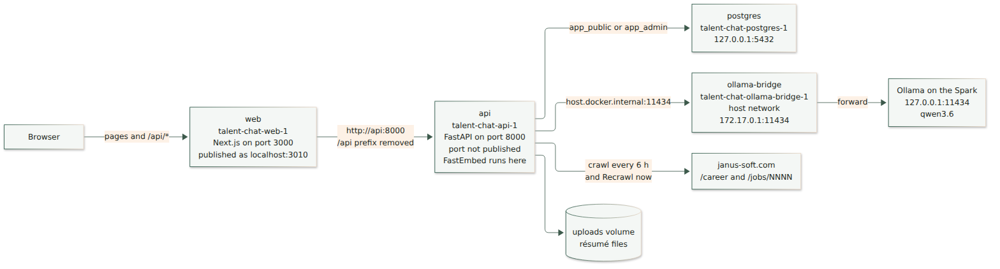
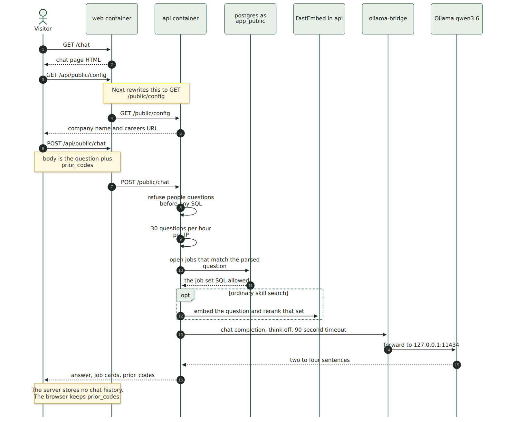
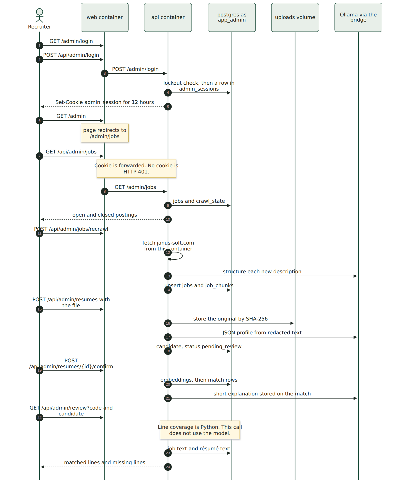

# Request workflow

How a browser request for `/chat` or `/admin` moves through the containers. The live stack is Docker Compose on the DGX Spark. The browser only talks to the `web` container. Port 8000 on `api` is not published.

Diagrams are PNG images. Sources are in [`docs/diagrams/`](docs/diagrams/). After editing a `.mmd` file, run `scripts/render-diagrams.sh`.

Related guides: [ARCHITECTURE.md](ARCHITECTURE.md), [llm.md](llm.md), [postgres.md](postgres.md).

---

## 1. Containers and ports

| Compose service | Container | What it listens on | Who can reach it |
| --- | --- | --- | --- |
| `web` | `talent-chat-web-1` | Next.js on port 3000 inside the container. Published as `localhost:3010` (`WEB_PORT` in `.env`). | Your browser |
| `api` | `talent-chat-api-1` | FastAPI on port 8000. Not published to the host. | `web`, on the Compose network, at host name `api` |
| `postgres` | `talent-chat-postgres-1` | Postgres 16 on port 5432. Published only on `127.0.0.1:5432`. | `api` at host name `postgres`. Host tools at `127.0.0.1` |
| `ollama-bridge` | `talent-chat-ollama-bridge-1` | Host network. Listens on `172.17.0.1:11434`. | `api`, which calls `host.docker.internal:11434` |
| — | Ollama on the Spark (systemd, not Compose) | `127.0.0.1:11434` only | The bridge, and anything on the Spark itself |

FastEmbed (`nomic-embed-text-v1.5`) runs inside the `api` process. It does not call Ollama. Résumé originals live on the `uploads` volume, mounted in `api` at `/app/data/uploads`.

`host.docker.internal` is `172.17.0.1`, the Docker bridge gateway (`extra_hosts` on the `api` service). Ollama refuses connections on that address because it binds to `127.0.0.1`. The bridge accepts the call on `172.17.0.1:11434` and forwards it to `127.0.0.1:11434`.

The careers crawl also runs inside `api`: once at startup, then every `CRAWL_INTERVAL_HOURS` (default 6), and again when a recruiter clicks Recrawl. Those HTTP calls go from `api` to `https://www.janus-soft.com/career` and each `/jobs/NNNN` page.

---

## 2. One rewrite for every API call

A page URL and an API URL are two different requests.

`http://localhost:3010/chat` is a Next.js page. The file is `web/app/chat/page.tsx`. Next serves HTML and JavaScript. That request never enters FastAPI.

The page’s JavaScript then calls `fetch("/api/public/chat")`. The browser sends that to the same host and port, `localhost:3010`, so the `admin_session` cookie stays first-party.

`web/next.config.ts` rewrites `/api/:path*` to `http://api:8000/:path*`. The `/api` prefix is removed. That destination is baked into the web image at build time (`API_INTERNAL_URL`).

| Browser asks web for | Web asks api for |
| --- | --- |
| `GET /api/public/config` | `GET http://api:8000/public/config` |
| `POST /api/public/chat` | `POST http://api:8000/public/chat` |
| `POST /api/admin/login` | `POST http://api:8000/admin/login` |
| `GET /api/admin/jobs` | `GET http://api:8000/admin/jobs` |

FastAPI mounts two routers in `api/app/main.py`:

- `api/app/public/routes.py` — prefix `/public`, database role `app_public`
- `api/app/admin/routes.py` — prefix `/admin`, database role `app_admin`

`GET /health` exists on the API for the Compose healthcheck. The browser does not call it. Inside the API container it is `http://127.0.0.1:8000/health`.

The Next proxy waits up to 120 seconds (`experimental.proxyTimeout`). A qwen answer can take longer than Next’s 30-second default, and a short wait was returning HTTP 500 to the browser while the API was still talking to Ollama.

---

## 3. Public chat

Open `http://localhost:3010/`. `web/app/page.tsx` redirects to `/chat`.

| Step | Where | What happens |
| --- | --- | --- |
| Page load | `web` | Serves the chat page. Middleware on `/chat` sets `Content-Security-Policy: frame-ancestors`. |
| Company name | `web` → `api` | `GET /api/public/config` reads settings only. No database. |
| Question | browser → `web` → `api` | `POST /api/public/chat` with `{ message, prior_codes }`. |
| People questions | `api` | Refusal text, no SQL, if the message asks about candidates, résumés, phones, or emails. |
| Rate limit | `api` | 30 questions per hour per client IP. HTTP 429 after that. |
| Which jobs | `api` → `postgres` | Session is `app_public`. That role can `SELECT` `jobs`, `job_chunks`, `skill_synonyms`, and `settings`. A query against `candidates` is permission denied. |
| Order | `api` | FastEmbed reranks that SQL set for an ordinary skill search. Distance and “not in this city” lists skip the rerank and sort in code. |
| Paragraph | `api` → bridge → Ollama | `qwen3.6` writes two to four sentences from the quotes. Temperature 0.2. Timeout 90 seconds, one retry. |
| Cards | `api` → browser | Answer, job cards, and `prior_codes` (up to 24 codes). |

The API stores no chat transcript. The browser keeps `prior_codes` in page state and sends them with the next question. A follow-up that says “these” or “closest to Bethesda within 20” stays on those codes. Miles are computed in `api` from `configs/locations.yaml` and passed to the model. If Ollama fails, the cards still return with the notice “Explanations are unavailable right now.”

`app_public` is used only for this search. Login, résumés, and match rows are unreachable on this connection.

---

## 4. Recruiter desk

`http://localhost:3010/admin` is `web/app/admin/page.tsx`. It redirects to `/admin/jobs`. The header links are Jobs, Match, Review, and Log out.

Next does not check the password. The HTML for `/admin/jobs` loads, then the page calls `GET /api/admin/jobs`. FastAPI reads the `admin_session` cookie. No valid session is HTTP 401, and the page sends the browser to `/admin/login`.

Login is `POST /api/admin/login` with the password. The API checks the argon2id hash, writes a row in `admin_sessions`, and sets an HttpOnly cookie named `admin_session` (path `/`, SameSite lax, 12 hours). The browser stores it for `localhost:3010` and sends it on later `/api/admin/*` calls. Next forwards that `Cookie` header to `api`. Logout is `POST /api/admin/logout`, which clears the cookie.

Every admin route uses `get_admin_db`, which is the `app_admin` role. That role can read and write jobs, candidates, matches, sessions, and the audit log.

### Screens and the calls they make

| Page | Browser path | API the page calls |
| --- | --- | --- |
| Sign in | `GET /admin/login` | `POST /api/admin/login` |
| Jobs | `GET /admin/jobs` | `GET /api/admin/jobs`, `POST /api/admin/jobs/recrawl` |
| One job | `GET /admin/jobs/{code}` | `GET /api/admin/jobs/{code}`, `PUT /api/admin/jobs/{code}`, `GET /api/admin/jobs/{code}/candidates` |
| Match | `GET /admin/match` | `GET/POST /api/admin/resumes`, `GET /api/admin/resumes/{id}`, `POST /api/admin/resumes/{id}/confirm`, `DELETE /api/admin/resumes/{id}` |
| Review | `GET /admin/review` | `GET /api/admin/jobs`, `GET /api/admin/resumes`, `GET /api/admin/review?code=&candidate_id=` |
| Log out | header button | `POST /api/admin/logout` |

Two admin routes exist and have no button in the current screens: `POST /api/admin/jobs/{code}/description` (file upload for a description) and `POST /api/admin/synonyms`. The job page saves a pasted description with `PUT /api/admin/jobs/{code}`.

### What each recruiter action touches

**Recrawl** runs in `api`. It fetches the careers site, asks `qwen3.6` to structure a description, embeds chunks with FastEmbed, and writes `jobs` and `job_chunks`.

**Upload** hashes the file. A known hash returns the existing candidate. A new PDF, DOCX, or TXT is stored on the uploads volume, Social Security numbers are redacted, and the model returns a JSON profile. The row is `pending_review`.

**Confirm** embeds the résumé and writes `matches`. The model’s short explanation is stored on the match row. The percents on Jobs, Match, and Review are line coverage computed in Python when the page loads. Review does not call the model.

---

## 5. Full API map

Browser path on port 3010, then the path inside the `api` container after the rewrite.

### Public — no cookie, role `app_public` after the refusal check

| Browser | Inside `api` | Notes |
| --- | --- | --- |
| `GET /api/public/config` | `GET /public/config` | Company name and careers URL |
| `POST /api/public/chat` | `POST /public/chat` | Search, then a model paragraph |

### Admin — cookie `admin_session`, role `app_admin`

| Browser | Inside `api` |
| --- | --- |
| `POST /api/admin/login` | `POST /admin/login` |
| `POST /api/admin/logout` | `POST /admin/logout` |
| `GET /api/admin/jobs` | `GET /admin/jobs` |
| `GET /api/admin/jobs/{code}` | `GET /admin/jobs/{code}` |
| `PUT /api/admin/jobs/{code}` | `PUT /admin/jobs/{code}` |
| `POST /api/admin/jobs/{code}/description` | `POST /admin/jobs/{code}/description` |
| `GET /api/admin/jobs/{code}/candidates` | `GET /admin/jobs/{code}/candidates` |
| `POST /api/admin/jobs/recrawl` | `POST /admin/jobs/recrawl` |
| `GET /api/admin/review` | `GET /admin/review` |
| `GET /api/admin/resumes` | `GET /admin/resumes` |
| `POST /api/admin/resumes` | `POST /admin/resumes` |
| `GET /api/admin/resumes/{id}` | `GET /admin/resumes/{id}` |
| `POST /api/admin/resumes/{id}/confirm` | `POST /admin/resumes/{id}/confirm` |
| `DELETE /api/admin/resumes/{id}` | `DELETE /admin/resumes/{id}` |
| `POST /api/admin/synonyms` | `POST /admin/synonyms` |

---

## 6. Files

| Piece | File |
| --- | --- |
| Chat page | `web/app/chat/page.tsx` |
| Admin pages | `web/app/admin/` |
| Rewrite and 120-second proxy wait | `web/next.config.ts` |
| Frame policy on `/chat` | `web/middleware.ts` |
| FastAPI app and `/health` | `api/app/main.py` |
| Public routes | `api/app/public/routes.py` |
| Admin routes and cookie check | `api/app/admin/routes.py`, `api/app/admin/auth.py` |
| Database roles | `api/app/db.py` |
| Compose services and ports | `docker-compose.yml` |
| Ollama forwarder | `scripts/ollama-bridge.py` |
